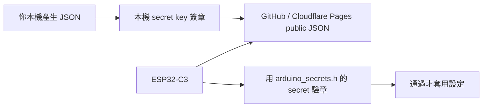

# ESP32-C3 Clock Web

無後端 ESP32-C3 鬧鐘控制專案。Cloudflare Pages 只放靜態網站和靜態 JSON；MCU 定期抓公開 JSON，並用 HMAC-SHA256 驗證簽章，通過才套用設定。



## What Is Public

公開網站和 JSON 內容大家都看得到，這是靜態網站的特性。安全重點是：

- JSON 可以公開
- `signature` 可以公開
- secret key 不可以公開
- MCU 只接受 secret key 算得出來的 signature

## Files

```text
src/                                      Signed config helper UI
public/devices/alarm_c3_001.json          Public signed config example
scripts/sign-config.mjs                   Local HMAC signing tool
esp32c3_alarm_external_api_complete/      ESP32-C3 firmware
esp32c3_alarm_external_api_complete/
  arduino_secrets.example.h               Public placeholder example
  arduino_secrets.h                       Local secrets, ignored by git
```

## Setup

Copy the secrets example:

```powershell
copy esp32c3_alarm_external_api_complete\arduino_secrets.example.h esp32c3_alarm_external_api_complete\arduino_secrets.h
```

Edit only `arduino_secrets.h`:

```cpp
#define ALARM_WIFI_SSID "YOUR_WIFI_SSID"
#define ALARM_WIFI_PASS "YOUR_WIFI_PASSWORD"
#define ALARM_SIGNED_CONFIG_URL "https://esp32c3-clock-web.pages.dev/devices/alarm_c3_001.json"
#define ALARM_ENABLE_CLOUD_SYNC true
#define ALARM_CONFIG_HMAC_SECRET "demo-only-change-me"
#define ALARM_REQUIRE_CONFIG_SIGNATURE true
```

Do not commit `arduino_secrets.h`.

The checked-in example uses the public demo secret `demo-only-change-me`, and
`public/devices/alarm_c3_001.json` is signed with that same value so a fresh copy
can boot and verify the sample JSON. This is only for first-run testing. For a
real device, replace `ALARM_CONFIG_HMAC_SECRET` with your own private random
secret, set the same value in your shell when signing JSON, then run
`npm run sign:config` or `npm run sign:config:py`.

## Sign Config

Edit:

```text
public/devices/alarm_c3_001.json
```

Then sign it locally:

```powershell
$env:ALARM_CONFIG_HMAC_SECRET="your-private-signing-secret"
npm run sign:config
```

Then push to GitHub. Cloudflare Pages will redeploy the static JSON. The MCU will fetch it on its next sync interval.

Signed static JSON is not immediate, so one-time remote commands were removed. Use it for the next alarm config only.

LED brightness is part of the signed config:

```text
ledPairBrightness: 0-10, controls LED A and LED B together
flashLedBrightness: 0-10, controls the separate flashing LED
```

The MCU applies brightness with PWM, so all LED patterns keep their timing but change intensity.

## Windows EXE Signer

You can package the Python signer as a Windows EXE:

```powershell
py -m pip install pyinstaller
py -m PyInstaller --onefile --name esp32c3-config-signer scripts\sign_config.py
```

The EXE will be created at:

```text
dist\esp32c3-config-signer.exe
```

Usage:

```powershell
.\dist\esp32c3-config-signer.exe --input public\devices\alarm_c3_001.json
```

It will ask for the signing secret. The secret is not saved into the EXE or JSON.

## Vibe Coding Done Notification

Codex/Gemini can notify the MCU when a coding task is done by calling the local MCU API:

```powershell
py scripts\notify_mcu.py --url http://192.168.1.23 --token "<local-token-if-enabled>"
```

The MCU will run the `notify_done` pattern: three LED flashes plus haptic pulses. This is local-network only; it does not use GitHub or Cloudflare.

You can package it as an EXE too:

```powershell
py -m PyInstaller --onefile --name esp32c3-notify-mcu scripts\notify_mcu.py
```

Then run:

```powershell
.\dist\esp32c3-notify-mcu.exe --url http://192.168.1.23 --token "<local-token-if-enabled>"
```

### Codex Global Prompt Setup

You can use Codex custom prompts in `~/.codex/prompts/*.md`, where the Markdown filename becomes a slash command. For behavior that should apply across projects, use a user-level Codex instruction/`AGENTS.md`.

Set local environment variables first, so the prompt does not contain your MCU IP/token:

```powershell
$env:MCU_NOTIFY_URL="http://192.168.1.23"
$env:MCU_NOTIFY_TOKEN="<local-token-if-enabled>"
$env:MCU_NOTIFY_EFFECT="10"
```

Or create a local `.env` file in this repo. It is ignored by git, and `scripts/notify_mcu.py` reads it automatically:

```text
MCU_NOTIFY_MODE=auto
MCU_NOTIFY_URL=
MCU_NOTIFY_TOKEN=<local-token-if-enabled>
MCU_NOTIFY_PORT=
MCU_NOTIFY_EFFECT=10
```

Notification modes:

- `auto`: try HTTP when `MCU_NOTIFY_URL` is set, otherwise try USB serial.
- `usb`: auto-detect the Codex MCU over USB serial, no IP needed. Set `MCU_NOTIFY_PORT=COM4` only if you want to force one port.
- `cloud`: update and sign `public/devices/alarm_c3_001.json`; deploy it, then the MCU runs the command on its next cloud sync.

The web console also has a USB Connect/Send panel. In Chrome or Edge, it uses Web Serial to send `codex_ping` and shows connected only after the MCU replies with `codex_pong`.

Then create:

```text
~/.codex/prompts/mcu-done.md
```

Use the template in:

```text
docs/CODEX_GLOBAL_PROMPT.md
```

After Codex finishes a task, run:

```text
/mcu-done
```

For more automatic behavior, copy the user-level `AGENTS.md` snippet from `docs/CODEX_GLOBAL_PROMPT.md` into your Codex global instructions. Keep tokens in environment variables, never inside the prompt file.

## Cloudflare Pages

```text
Framework preset: None
Build command: npm run build
Build output directory: dist
```

No Functions, KV, database, or backend API is required.
