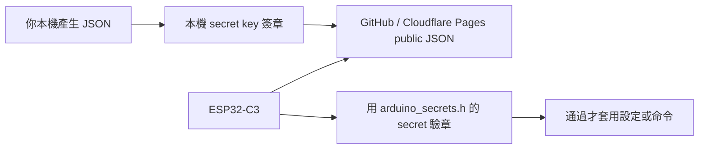

# ESP32-C3 Clock Web

無後端 ESP32-C3 鬧鐘控制專案。Cloudflare Pages 只放靜態網站和靜態 JSON；MCU 定期抓公開 JSON，並用 HMAC-SHA256 驗證簽章，通過才套用設定。



## What Is Public

公開網站和 JSON 內容大家都看得到，這是靜態網站的特性。安全重點是：

- JSON 可以公開
- `signature` 可以公開
- secret key 不可以公開
- MCU 只接受 secret key 算得出來的 signature

## Files

```text
src/                                      Signed config helper UI
public/devices/alarm_c3_001.json          Public signed config example
scripts/sign-config.mjs                   Local HMAC signing tool
esp32c3_alarm_external_api_complete/      ESP32-C3 firmware
esp32c3_alarm_external_api_complete/
  arduino_secrets.example.h               Public placeholder example
  arduino_secrets.h                       Local secrets, ignored by git
```

## Setup

Copy the secrets example:

```powershell
copy esp32c3_alarm_external_api_complete\arduino_secrets.example.h esp32c3_alarm_external_api_complete\arduino_secrets.h
```

Edit only `arduino_secrets.h`:

```cpp
#define ALARM_WIFI_SSID "YOUR_WIFI_SSID"
#define ALARM_WIFI_PASS "YOUR_WIFI_PASSWORD"
#define ALARM_SIGNED_CONFIG_URL "https://esp32c3-clock-web.pages.dev/devices/alarm_c3_001.json"
#define ALARM_ENABLE_CLOUD_SYNC true
#define ALARM_CONFIG_HMAC_SECRET "your-private-signing-secret"
#define ALARM_REQUIRE_CONFIG_SIGNATURE true
```

Do not commit `arduino_secrets.h`.

## Sign Config

Edit:

```text
public/devices/alarm_c3_001.json
```

Then sign it locally:

```powershell
$env:ALARM_CONFIG_HMAC_SECRET="your-private-signing-secret"
npm run sign:config
```

Then push to GitHub. Cloudflare Pages will redeploy the static JSON. The MCU will fetch it on its next sync interval.

## Cloudflare Pages

```text
Framework preset: None
Build command: npm run build
Build output directory: dist
```

No Functions, KV, database, or backend API is required.
