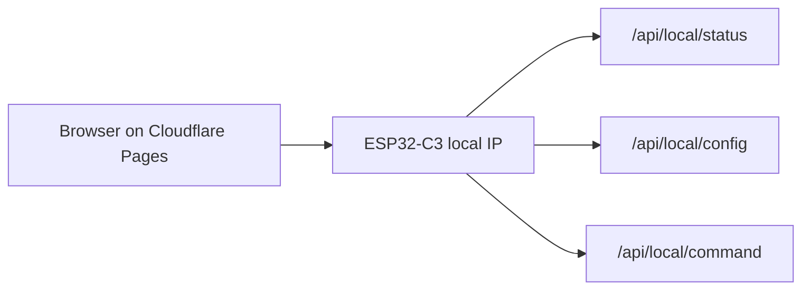

# Cloudflare Pages Static Deployment

This project no longer uses a backend. Cloudflare Pages only hosts the static React build.

## Build Settings

```text
Framework preset: None
Build command: npm run build
Build output directory: dist
```

No KV binding, Pages Functions, `DEVICE_TOKEN`, or Cloudflare Access setup is required.

## How Control Works



The MCU must be reachable from the browser's current network.

## Mixed Content Note

Cloudflare Pages serves HTTPS. Some browsers block HTTPS pages from calling local HTTP devices like `http://192.168.x.x`.

If this happens, use one of these:

- Open the MCU website directly: `http://<MCU-IP>/`
- Run the web UI locally: `npm run dev`
- Put the web UI on a local HTTP server for testing

## Secrets

Do not put WiFi passwords or tokens in GitHub or Cloudflare variables. Store them only in:

```text
esp32c3_alarm_external_api_complete/arduino_secrets.h
```

That file is ignored by git.
