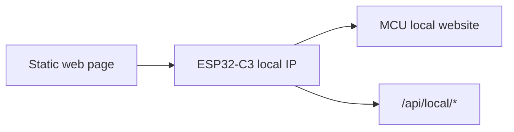

# Deployment Mode

This repo now has one supported mode: no backend, direct MCU control.



## Options

Use either:

- Cloudflare Pages static web UI: good for hosting the UI, but browser local-network restrictions may apply.
- MCU-hosted page: open `http://<MCU-IP>/` directly; best when Cloudflare HTTPS cannot call local HTTP.
- Local dev page: run `npm run dev` on your computer.

## What Is Not Used

- No Cloudflare Pages Functions
- No Cloudflare KV
- No `DEVICE_TOKEN`
- No backend API stored in GitHub

## Secret Storage

Only `arduino_secrets.h` should contain private values:

```cpp
#define ALARM_WIFI_SSID "..."
#define ALARM_WIFI_PASS "..."
// #define ALARM_LOCAL_API_TOKEN "..."
```

`arduino_secrets.h` is ignored by git.
