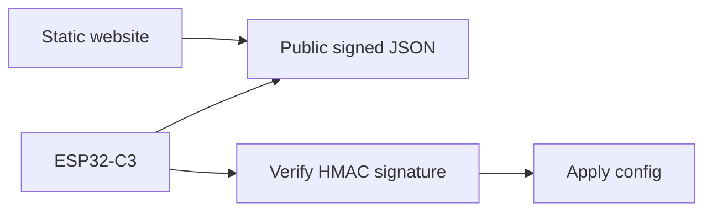

# Deployment Mode

This repo uses one mode: signed static config.

This gives you:

- no backend
- no MQTT broker
- no API key in the website
- protection against unauthorized changes

It does not hide the JSON contents. Anyone can read the alarm settings if the JSON URL is public.
