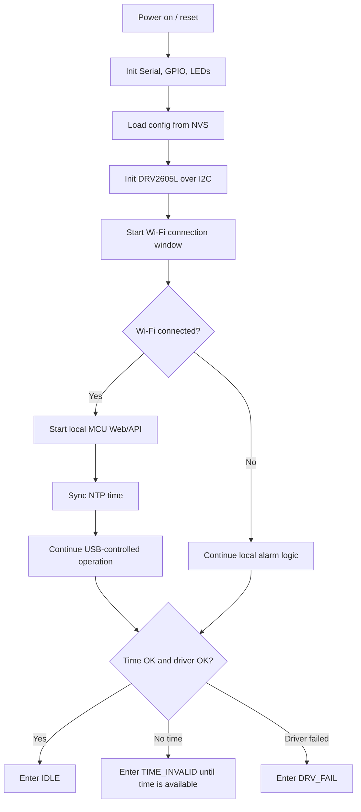
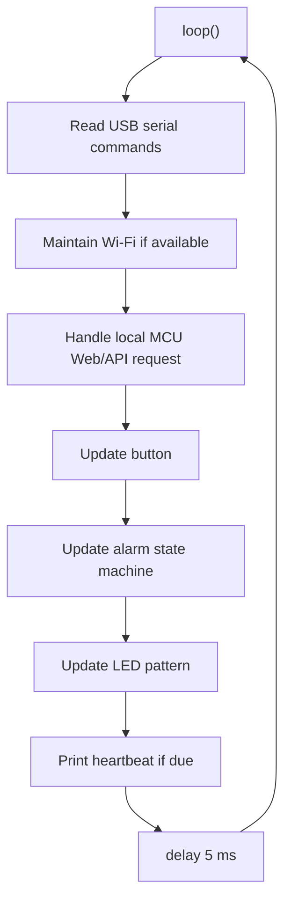

# MCU Logic

The starter firmware is USB-first:

- Load alarm/output config from ESP32 NVS.
- Run the alarm state machine and hardware outputs.
- Accept config and commands over USB serial.
- Optionally maintain Wi-Fi for NTP/local API if credentials are configured.
- Keep legacy signed JSON cloud sync available, but disabled by default.

## Startup Flow



## Main Loop



## USB Commands

```text
codex_ping
notify_done 10
test_led
test_haptic 10
stop_alarm
snooze
set_config {"enabled":true,"hour":7,"minute":30,"repeatMask":62,"ledPairBrightness":4}
```

`set_config` applies the provided alarm/output fields, clamps safe ranges, and writes changed settings to NVS.

## Persisted Settings

When USB `set_config` or the local MCU API changes alarm/output settings, the MCU saves the new config to ESP32 NVS (`Preferences`) so it survives reboot and power loss. Unchanged payloads skip the NVS write to reduce flash wear.

Persisted values:

```text
enabled
hour
minute
repeatMask
prealertSec
snoozeMin
maxRingSec
hapticEffect
ledPairBrightness
flashLedBrightness
version
lastCommandId
```

`ledPairBrightness` controls LED A and LED B together. `flashLedBrightness` controls the separate flashing LED. Both use PWM on the ESP32-C3 LEDC peripheral.

## Wi-Fi Notes

Wi-Fi is no longer required for control. It can still be useful for NTP time sync or the optional local HTTP API. Starter config disables cloud sync:

```cpp
#define ALARM_ENABLE_CLOUD_SYNC false
```

If the device has trouble connecting to Wi-Fi:

- Increase `ALARM_BOOT_STABILIZE_MS` to `2000UL`.
- Raise `ALARM_WIFI_CONNECT_TX_POWER` one step.
- Increase `ALARM_WIFI_CONNECT_TIMEOUT_MS` to `15000UL` or `20000UL`.
- Keep `ALARM_WIFI_RETRY_INTERVAL_MS` long enough to avoid repeated high-power connection attempts.
