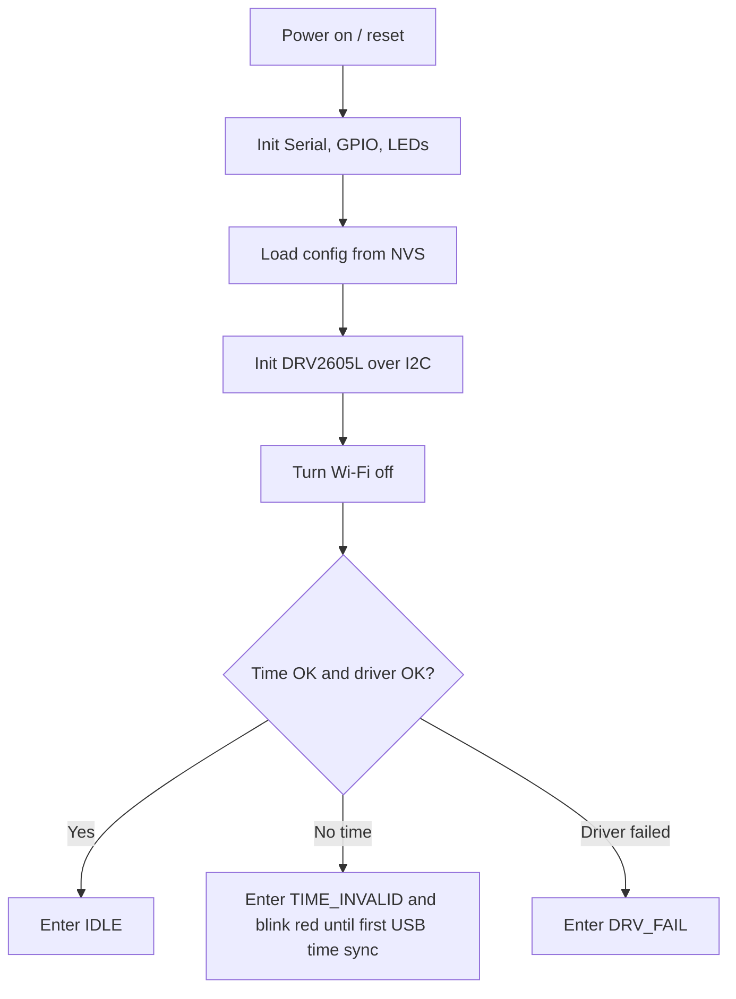
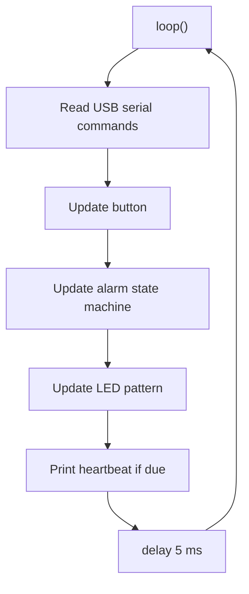

# MCU Logic

The starter firmware is USB-first:

- Load alarm/output config from ESP32 NVS.
- Run the alarm state machine and hardware outputs.
- Accept config and commands over USB serial.
- Accept time updates over USB serial.
- Keep Wi-Fi off during runtime.

## Startup Flow



## Main Loop



## USB Commands

```text
codex_ping
usb_keepalive
set_time 1780000000
get_config
codex_busy
notify_done 10
codex_idle
test_led
test_haptic 10
stop_alarm
snooze
set_config {"enabled":true,"hour":7,"minute":30,"repeatMask":62,"ledPairBrightness":4}
run_pattern {"command":"notify_done","green":"blink","red":"off","flash":"blink","haptic":"on","intervalMs":180,"count":6}
```

`usb_keepalive` keeps the serial session active. On fresh power-up, if MCU time is invalid and no USB time sync has succeeded yet, the MCU blinks the red time-sync prompt. After one successful sync, stale time does not make it blink forever.
`get_config` returns the current MCU config so the web console can use the device values as defaults after connecting.
`run_pattern` runs editable green/red/flash LED and haptic behavior with configurable mode, interval, and count.
`codex_busy` shows solid red while Codex is working. `notify_done` clears busy, flashes/vibrates, then shows solid green. `codex_idle` clears the Codex status light. In `scripts/notify_mcu.py`, `message-sent` maps to `codex_busy` and `answer-done` maps to `notify_done`, so Codex can alert once after receiving a prompt and again after finishing the answer.
`set_config` applies the provided alarm/output fields, clamps safe ranges, and writes changed settings to NVS.
`set_time` sets the MCU clock from Unix epoch seconds provided by the browser/computer over USB. The web console opens USB only for the current action, sends time/config/command data as needed, then closes the port again so local Codex/Gemini notifications can use the same COM port.

## Persisted Settings

When USB `set_config` changes alarm/output settings, the MCU saves the new config to ESP32 NVS (`Preferences`) so it survives reboot and power loss. Unchanged payloads skip the NVS write to reduce flash wear.

Persisted values:

```text
enabled
hour
minute
repeatMask
prealertSec
snoozeMin
maxRingSec
hapticEffect
ledPairBrightness
flashLedBrightness
lastCommandId
```

`ledPairBrightness` controls LED A and LED B together. `flashLedBrightness` controls the separate flashing LED. Both use PWM on the ESP32-C3 LEDC peripheral.

## Wi-Fi Notes

The MCU turns Wi-Fi off during setup and does not retry network connections. Use USB for config, commands, and time sync.
