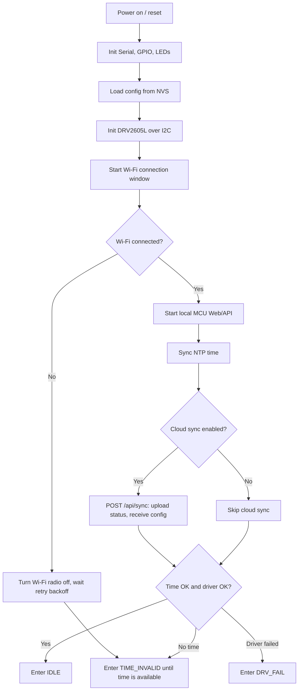
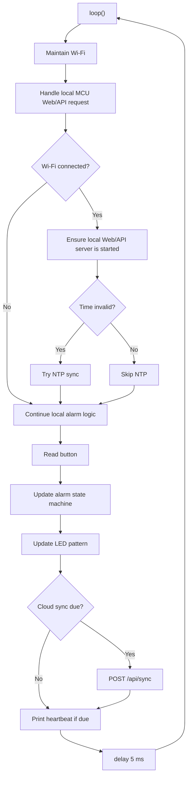
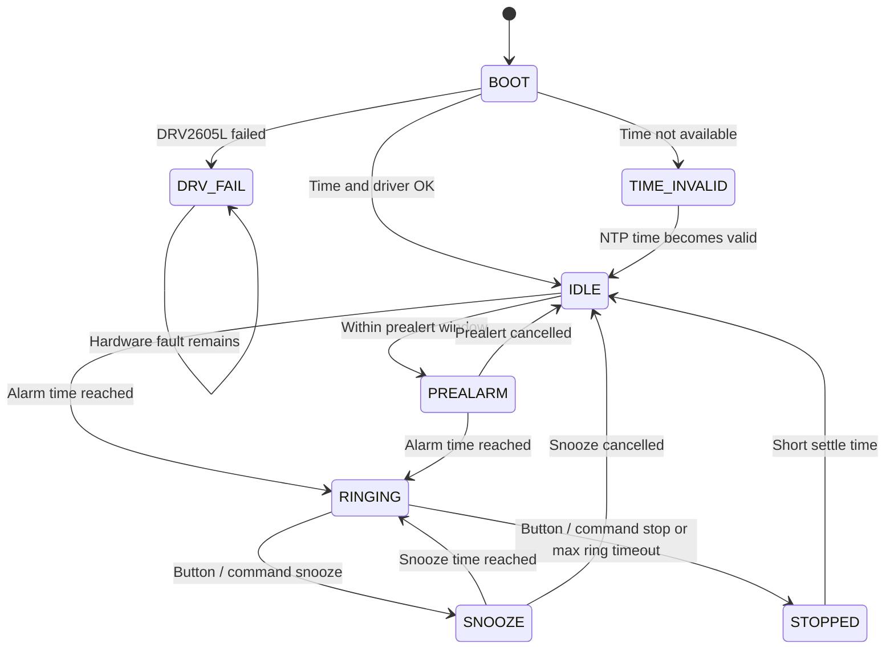

# MCU Logic

The ESP32-C3 firmware has four main jobs:

- Maintain Wi-Fi with low-power retry behavior.
- Keep local alarm config in NVS.
- Run the alarm state machine and hardware outputs.
- Optionally sync with Cloudflare or serve local MCU APIs.

## Startup Flow



## Main Loop



## Alarm State Machine



## Wi-Fi Power Strategy

The firmware does not scan for SSIDs before connecting. It directly attempts `WiFi.begin()` because scanning costs time and power, and phone hotspots can change state between scan and connect.

Connection behavior:

- Open a short connection window.
- Use `ALARM_WIFI_CONNECT_TX_POWER` only while associating.
- After getting an IP, switch back to the configured low-power TX power and modem sleep setting.
- If connection fails, disconnect and turn Wi-Fi radio off.
- Wait with exponential backoff before the next attempt.

This means the MCU can still run the alarm locally even when Wi-Fi is unavailable, while avoiding constant high-power connection attempts.

Tuning knobs in `arduino_secrets.h`:

```cpp
#define ALARM_WIFI_SLEEP true
#define ALARM_WIFI_TX_POWER WIFI_POWER_11dBm
#define ALARM_WIFI_CONNECT_TX_POWER WIFI_POWER_15dBm
#define ALARM_WIFI_CONNECT_TIMEOUT_MS 12000UL
#define ALARM_WIFI_RETRY_INTERVAL_MS 60000UL
#define ALARM_WIFI_RETRY_MAX_INTERVAL_MS 300000UL
#define ALARM_WIFI_AUTH_FAST_RETRY_MS 15000UL
#define ALARM_WIFI_AUTH_FAST_RETRY_MAX 3
#define ALARM_WIFI_MIN_SECURITY WIFI_AUTH_WPA_PSK
```

If the device still sometimes cannot connect:

- Raise `ALARM_WIFI_CONNECT_TX_POWER` one step.
- Increase `ALARM_WIFI_CONNECT_TIMEOUT_MS` to `15000UL` or `20000UL` for slow phone hotspots.
- Keep `ALARM_WIFI_RETRY_INTERVAL_MS` long enough to avoid repeated high-power connection attempts.
- `STA_DISCONNECTED reason=2` means auth expired. The firmware now treats this as a short fast retry case before falling back to long exponential retry.
- If your router is strictly WPA2-only and you want stricter security, set `ALARM_WIFI_MIN_SECURITY WIFI_AUTH_WPA2_PSK`. The default `WIFI_AUTH_WPA_PSK` is more compatible with WPA/WPA2 mixed hotspots.

If battery/power is more important than fast reconnect:

- Increase `ALARM_WIFI_RETRY_INTERVAL_MS`.
- Increase `ALARM_WIFI_RETRY_MAX_INTERVAL_MS`.
- Disable cloud sync with `ALARM_ENABLE_CLOUD_SYNC false` and use local MCU mode only.
